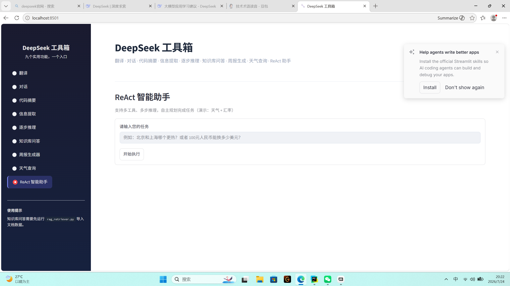
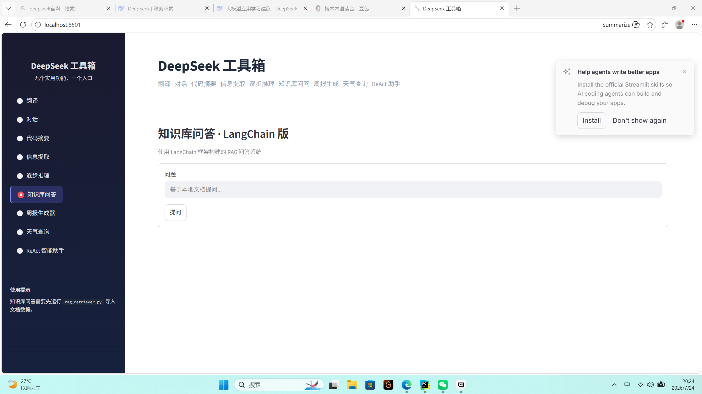

# DeepSeek 工具箱

基于 DeepSeek API 构建的多功能工具集，支持命令行和 Web 两种交互方式，涵盖翻译、对话、代码摘要、信息提取、逐步推理、知识库问答、周报生成、天气查询和 ReAct 智能助手九个实用功能。

## 功能列表

| 功能 | 说明 |
| :--- | :--- |
| 翻译 | 支持中英日韩法德六种语言互译 |
| 自由对话 | 多轮上下文对话，支持清空历史 |
| 代码摘要 | 3-5 句话概括代码功能和逻辑 |
| 信息提取 | Few-shot 方式从文本中提取结构化 JSON |
| 逐步推理 | 标准 CoT + Self-Consistency 多次投票 |
| 知识库问答 | 基于 LangChain 的 RAG 问答，父子文档检索 |
| 周报生成器 | 输入工作内容，自动生成结构化周报 |
| 天气查询 | 输入城市名称，查询当前天气情况 |
| ReAct 智能助手 | 多工具、多步推理 Agent，自主规划完成任务 |

## 项目结构

```
├── app.py                 # Streamlit Web 界面（9 个功能模块）
├── main.py                # 命令行入口（API 连通性测试）
├── api.py                 # FastAPI 后端服务（翻译接口 + 日志）
├── agent_demo.py          # Function Calling Agent 命令行演示
├── rag_retriever.py       # 父子文档切分 + 向量入库
├── rag_langchain.py       # LangChain 版 RAG 问答
├── evaluate_rag.py        # RAGAS 评估系统质量
├── test_embedding.py      # 向量相似度测试
├── test_fewshot.py        # Few-shot 学习演示
├── Dockerfile             # Docker 容器化部署
├── data/
│   └── my_doc.txt         # 知识库文档
├── chroma_db/             # 向量数据库
├── images/                # 效果截图
├── notes/                 # 学习笔记
├── .env.example           # 环境变量模板
└── requirements.txt       # 依赖清单
```

## 技术栈

- **前端**：Streamlit（自定义 CSS，Indigo 色调）
- **后端**：FastAPI
- **LLM**：DeepSeek API（兼容 OpenAI SDK）
- **向量库**：ChromaDB + sentence-transformers
- **RAG 框架**：LangChain（RetrievalQA 链）
- **评估**：RAGAS（Faithfulness + Answer Relevancy）
- **部署**：Docker
- **语言**：Python 3.10+

## 快速开始

```bash
# 1. 克隆项目
git clone https://github.com/169hu/deepseek-learning.git
cd deepseek-learning

# 2. 安装依赖
pip install -r requirements.txt

# 3. 配置密钥
cp .env.example .env
# 编辑 .env，填入你的 DEEPSEEK_API_KEY

# 4. 构建知识库（可选，RAG 模式需要）
python rag_retriever.py

# 5. 启动 Web 界面
streamlit run app.py

# 6. 启动 API 服务（可选）
uvicorn api:app --host 0.0.0.0 --port 8000
```

## Docker 部署

```bash
docker build -t deepseek-toolbox .
docker run -p 8000:8000 --env-file .env deepseek-toolbox
```

## 效果截图

### 主界面


### RAG 知识库问答


## 作者

**胡进林** · 计算机科学与技术专业 · 大三

- 邮箱：161725862@qq.com
- GitHub：[169hu](https://github.com/169hu)
- 目标岗位：大模型应用开发实习生